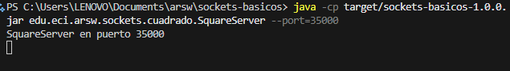
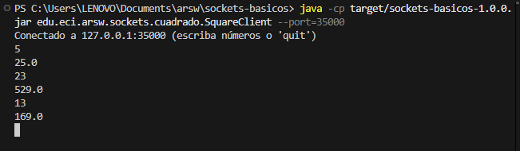
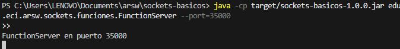
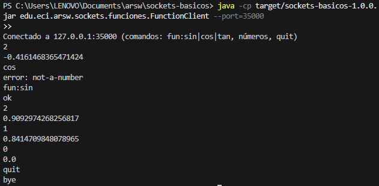

# sockets-basicos

## David Santiago Castro

## Ejercicio 3: Cuadrado (TCP): funcionalidad y solución

### Funcionalidad
– Servicio TCP que recibe números en texto y responde su cuadrado como texto de doble precisión.
– Protocolo simple: una línea de solicitud → una línea de respuesta.
– Palabra clave “quit” para terminar la sesión con respuesta “bye”.
– Entradas no numéricas producen “error: not-a-number”.
– Cliente de consola que envía líneas y muestra respuestas, validando el intercambio extremo a extremo.

### Solución técnica
– Protocolo de texto lineal para evitar problemas de framing y facilitar pruebas manuales/automatizadas.
– Servidor secuencial: atiende un cliente a la vez; cada sesión se maneja con lectura/escritura bloqueante y cierre ordenado.
– Lectura con BufferedReader y escritura con PrintWriter con auto-flush para respuestas inmediatas.
– Parseo numérico con Double.parseDouble y manejo explícito de NumberFormatException.
– Cálculo directo d*d y serialización con Double.toString para formato consistente.
– Recursos gestionados con try-with-resources por conexión; ciclo principal gobernado por una bandera atómica para apagado limpio en pruebas.
– Puerto configurable mediante argumentos; valor por defecto alineado con el material del curso.

### Decisiones y consideraciones
– Secuencial por requerimiento: elimina condiciones de carrera y simplifica el estado.
– Si se evoluciona a concurrencia, se recomienda un hilo por cliente o pool y estado por sesión (no global).
– Protocolo textual por claridad, interoperabilidad y menor acoplamiento.
– Mensajería de error legible para el usuario, sin derribar la sesión ante entradas inválidas.
– Comportamiento determinista para entradas válidas; para NaN/Infinity se asume la semántica estándar de double.

### Pruebas
– Arranque del servidor en un hilo usando un puerto efímero para evitar colisiones.
– Conexión de cliente de prueba que envía “5” y verifica “25.0”; luego “quit” y verifica “bye”.
– Cobertura de la ruta de error con entrada no numérica.
– Aseguramiento de cierre de sockets y detención del servidor al finalizar cada test para mantener determinismo y rapidez.

## Ejercicio 4: Funciones trigonométricas (TCP): funcionalidad y solución

• Funcionalidad
– Servicio TCP con estado que aplica una función trigonométrica a números recibidos.
– Estado inicial: coseno; se cambia con comandos “fun:sin”, “fun:cos” o “fun:tan”.
– Protocolo simple: una línea de solicitud → una línea de respuesta.
– “quit” cierra la sesión con “bye”; entradas no numéricas que no sean comandos válidos producen “error: not-a-number”.
– Cliente de consola para enviar comandos, números y observar respuestas en tiempo real.

### Solución técnica
– Reutilización del protocolo textual lineal del ejercicio 3 para consistencia y simplicidad.
– Variable de estado que referencia la operación actual como función double→double (p. ej., Math::cos, Math::sin, Math::tan).
– Conmutación de función mediante comandos “fun:…”, con confirmación “ok” y manejo de “error: unknown-fun” para comandos inválidos.
– Servidor secuencial por requerimiento; ausencia de sincronización adicional al no compartir estado entre sesiones concurrentes.
– E/S con BufferedReader y PrintWriter con auto-flush; parseo con Double.parseDouble y tratamiento de NumberFormatException.
– Tolerancia numérica asumida por la naturaleza de double (por ejemplo, cos(π/2) ≈ 0 con pequeño error).
– Puerto configurable mediante argumentos; valor por defecto coherente con el curso.
– Cierre ordenado de recursos y bandera de ejecución para apagado limpio en pruebas.

### Decisiones y consideraciones
– Estado mutable controlado a nivel de sesión en servidor secuencial: simple y suficiente para el objetivo pedagógico.
– Para versión concurrente, mover el estado a contexto por conexión para evitar interferencia entre clientes.
– Comandos explícitos para separar control de datos y facilitar comprensión del protocolo.
– Errores informativos y cierres ordenados para una buena experiencia de usuario.
– Se asume semántica estándar de double; valores extremos (p. ej., tan cerca de π/2) pueden crecer mucho o producir Infinity conforme a IEEE-754.

### Pruebas
– Servidor en puerto efímero y cliente de prueba con secuencia controlada.
– Verificación de coseno por defecto: entrada 0 devuelve ≈ 1.
– Cambio a seno con “fun:sin” y verificación: entrada 0 devuelve ≈ 0.
– Retorno a coseno y verificación con π/2: resultado cercano a 0 dentro de tolerancia pequeña.
– Confirmación de “quit” y cierre de sesión; liberación de recursos y detención del servidor al concluir.

## Resultados de Ejecucion

### Ejercicio 3:

Ponemos el siguiente codigo en la terminal del ide, o corremos la clase SquareServer para correr el servidor 

java -cp target/sockets-basicos-1.0.0.jar edu.eci.arsw.sockets.cuadrado.SquareServer --port=35000

Luego corremos SquareClient

java -cp target/sockets-basicos-1.0.0.jar edu.eci.arsw.sockets.cuadrado.SquareClient --port=35000

### Ejercicio 4:

Ponemos el siguiente codigo en la terminal del ide, o corremos la clase FunctionServer para correr el servidor 

Luego corremos FunctionClient

java -cp target/sockets-basicos-1.0.0.jar edu.eci.arsw.sockets.funciones.FunctionClient --port=35000

